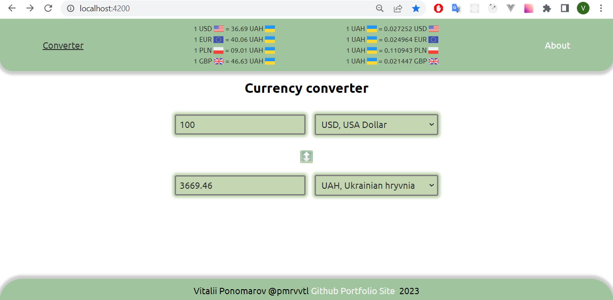
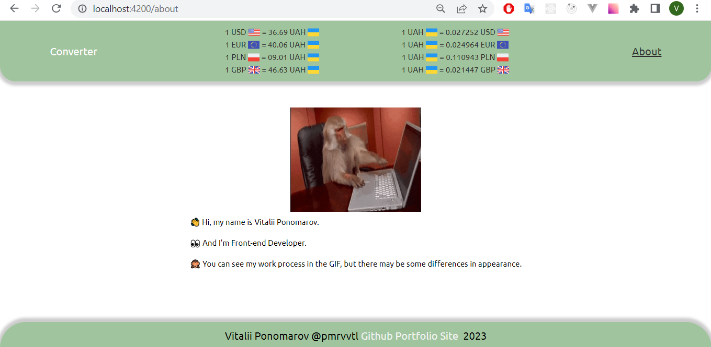
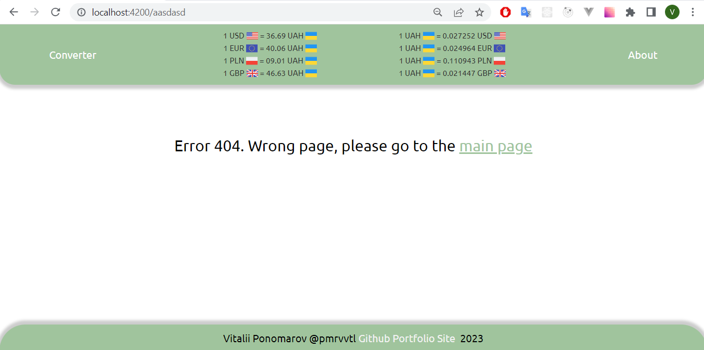

# Currency Converter
Testing project for ITOP1000 by @pnmrvvtl

Deploy of application: https://itop1000-pnmrvvtl-converter.netlify.app/

In app implemented routing and below you can see screenshots of application:
1. Main page

2. About page

3. Error page

Run `ng serve` for a dev server. Navigate to `http://localhost:4200/`. API key provided in source code in cause that it is a free API and I don't want waste you time for creating .env file and getting your own API key.

